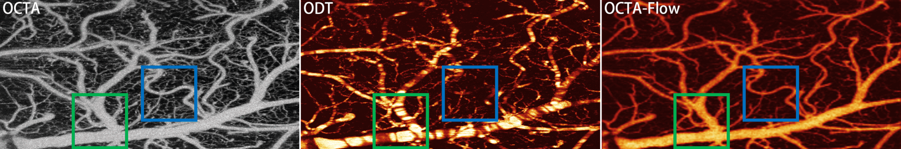

# OCTA-Flow

This is the official PyTorch implementation code for OCTA-Flow.

>**Blood Flow Speed Estimation with Optical Coherence Tomography Angiography Images** <br/>
Wensheng Cheng<sup>1</sup>, Zhenghong Li<sup>1</sup>, Jiaxiang Ren<sup>1</sup>, Hyomin Jeong<sup>2</sup>,
Congwu Du<sup>2</sup>, Yingtian Pan<sup>2</sup>, Haibin Ling<sup>1</sup> <br/>
<sup>1</sup>Department of Computer Science, <sup>2</sup>Department of Biomedical Engineering, Stony Brook University <br>
**CVPR 2025** <br/>
**[[Paper](https://github.com/Spritea/OCTA-Flow)]** | **[[Supp](https://github.com/Spritea/OCTA-Flow)]**

## Highlights
* First work to directly estimate blood flow speed with OCTA images.
* Use ODT data with artifacts as the pseudo label when the ground truth data is not available.
* Generate accurate and robust blood flow speed estimation in the presence of artifacts.
* Paired OCTA-ODT datasets on the cerebral cortex region in animals.

<figure>
  
</figure>

## Contents
1. [Installation](#installation)
2. [Training](#training)
3. [Evaluation](#evaluation)
4. [Inference](#inference)
5. [Checkpoints](#checkpoints)

## Installation
```
conda create -n newcrfs python=3.8
conda activate newcrfs
conda install pytorch=1.10.0 torchvision cudatoolkit=11.1
pip install mmcv==2.2.0 -f https://download.openmmlab.com/mmcv/dist/cu111/torch1.10/index.html
pip install timm==1.0.9
pip install matplotlib, tqdm, tensorboardX
```

## Training
First download the pretrained encoder backbone from [here](https://github.com/microsoft/Swin-Transformer) (we use the Swin-T backbone pretrained on ImageNet-1K), and then modify the pretrain path in the config files.

Training the OCTA-Flow model on Anesthetized Dataset:
```
cd OCTA-Flow
bash scripts/train_anesthetized_save_all.sh
```

Training the OCTA-Flow model on Awake Dataset:
```
cd OCTA-Flow
bash scripts/train_awake_save_all.sh
```

## Evaluation
Set the checkpoint path in `octaflow/eval_anesthetized.py`, and then evaluate the OCTA-Flow model on Anesthetized Dataset to get metrics:
```
cd OCTA-Flow
python octaflow/eval_anesthetized.py
```

Set the checkpoint path in `octaflow/eval_awake.py`, and then evaluate the OCTA-Flow model on Awake Dataset to get metrics:
```
cd OCTA-Flow
python octaflow/eval_awake.py
```
## Inference
Set the checkpoint path and images for inference in `octaflow/inference_val_images_oca2odt_anesthetized.py`, and then predict blood flow speed with the trained model on Anesthetized Dataset:
```
cd OCTA-Flow/octaflow
python inference_val_images_oca2odt_anesthetized.py
```

Set the checkpoint path and images for inference in `octaflow/inference_val_images_oca2odt_awake.py`, and then predict blood flow speed with the trained model on Awake Dataset:
```
cd OCTA-Flow/octaflow
python inference_val_images_oca2odt_awake.py
```
## Checkpoints
The models trained on the default dataset split (fold 0) are available below.

| Model | Abs.Rel. | RMSE |
|---|---|---|
| Anesthetized | 0.3275 | 6.6611 |
| Awake | 0.3363 | 7.0713 |


## Acknowledgements
This implementation code is heavily based on the [NeWCRFs](https://github.com/aliyun/NeWCRFs) work, and the [Swin Transformer](https://github.com/microsoft/Swin-Transformer) work. Thanks for their great work!
